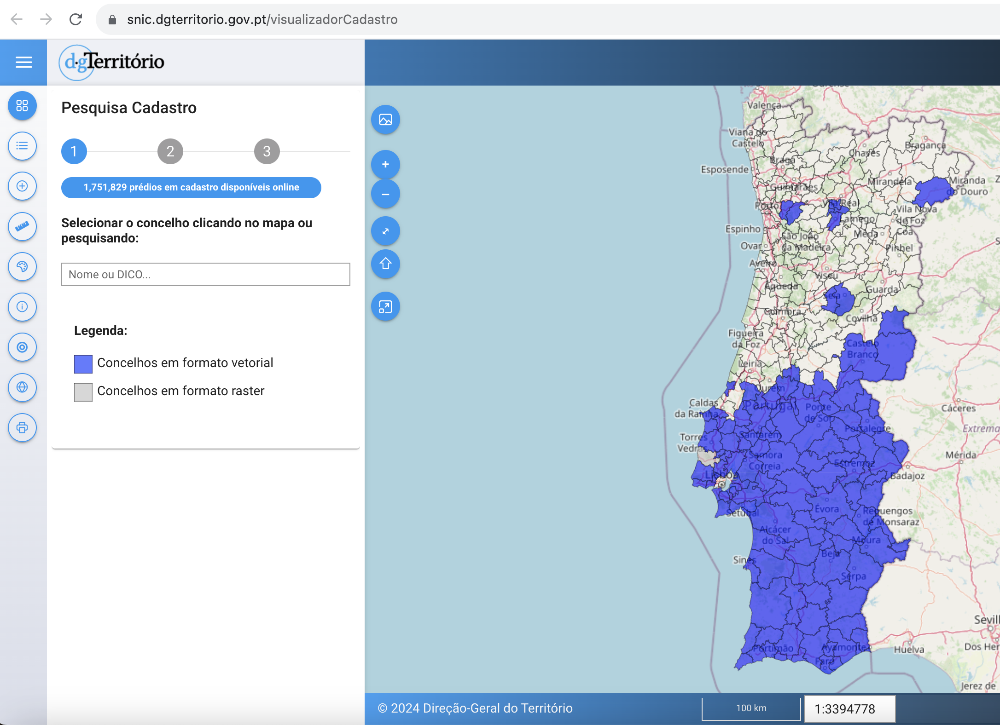
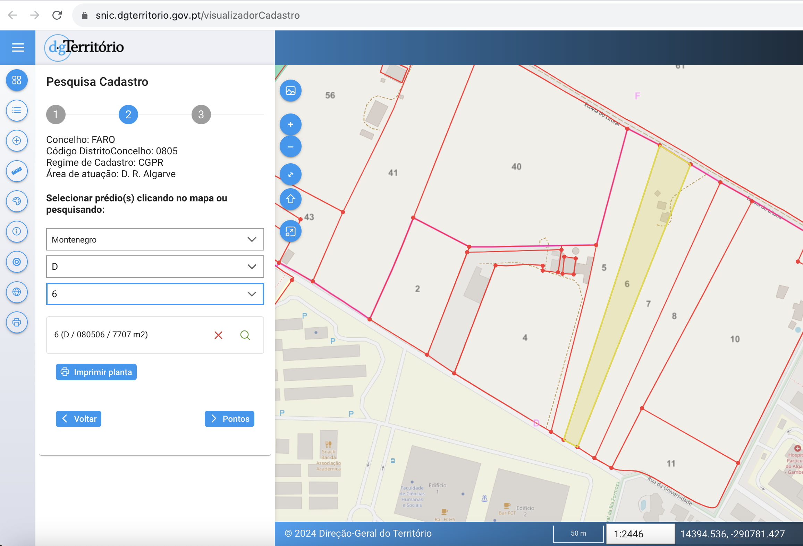
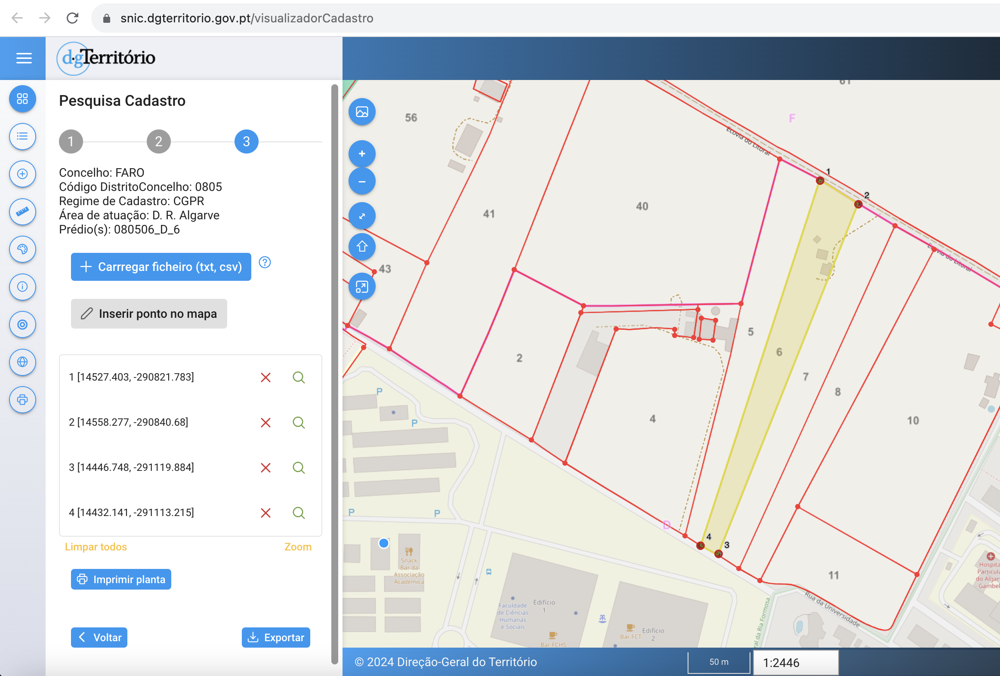

# snic-2-googlemaps

SNIC 2 GoogleMaps e uma aplicacao de Javascript que permite a migracao do cadastro predial do SNIC (Sistema Nacional de Informacao Cadastral) para a plataforma Google Maps.

## Como funciona?

Primeiro o cadastro predial deve ser exportado em formato geojson. Para tal basta abrir o [site da DGT](https://snic.dgterritorio.gov.pt/visualizadorCadastro) pesquisar o(s) predio(s) pretendido(s) e criar/identificar os pontos que definem o(s) poligono(s) de cada predio(s) tal como consta nas imagens abaixo:





De seguida todos os ficheiros geojson devem ser copiados para a pasta `input`.

Finalmente basta correr o aplicacao Javascript atraves do comando `npm run start` para iniciar a conversao do formato geojson para CSV.

O ficheiro CSV gerado encontra-se na pasta `output` e contem as coordenadas em formato [WKT](https://en.wikipedia.org/wiki/Well-known_text_representation_of_geometry), assim como os nomes de cada poligono automaticamente gerados atraves do nome de cada ficheiro geojson.

Para finalizar devera criar um mapa na plataform [My Maps](https://www.google.com/maps/d/), criar uma layer e importar o ficheiro CSV gerado.

Pode ainda criar um URL de partilha para enviar a amigos e familiares.

## Instalacao

Para instalar as dependencias:

```bash
bun install
```

Para correr a aplicacao:

```bash
bun run src/index.ts
```

This project was created using `bun init` in bun v1.0.25. [Bun](https://bun.sh) is a fast all-in-one JavaScript runtime.
